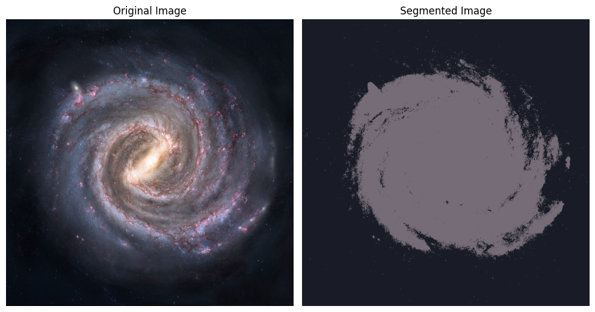

# Fuzzy C-means Segmentation

This repository contains an implementation of the Fuzzy C-means (FCM) algorithm for image segmentation. The FCM algorithm is a clustering technique that allows for "soft" clustering, meaning each pixel in an image can belong to multiple clusters with varying degrees of membership. This makes it useful for images with soft boundaries, where distinguishing between objects and background is challenging.

Milkway visualisation (5 clusters)

## Features

- **Gray-scale and RGB image segmentation**: Supports both gray-scale and color images.
- **Customizable number of clusters**: Set the number of clusters to adjust segmentation detail.
- **Flexible parameters**: Adjust `m` (fuzziness) and `epsilon` (convergence threshold).
- **Progressive heatmap generation**: Visualize the degree of membership for each pixel across clusters.

## Files

- **`Fuzzy_C_means.ipynb`**: Jupyter notebook with the main implementation and examples for image segmentation.
- **content**: Includes examples using images of the Milky Way and a cat to demonstrate segmentation results.
- **TP_FUZZY_C_MEANS_REBAI.pdf**: Report pdf.

## Example Results

- **Milky Way image** segmented with 2 and 5 clusters in gray-scale and RGB modes.
- **Cat image** segmented with 3 clusters to highlight different textures and colors.

## Requirements

- OpenCV
- NumPy
- Matplotlib
- tqdm
  
